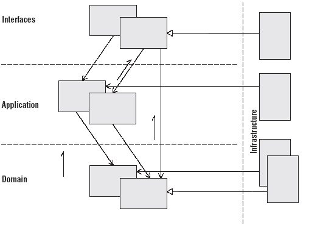

# The Problem
## Introduction
The original fizz-buzz consists in writing all numbers from 1 to 100,
and just replacing all multiples of 3 by "fizz", all multiples of 5 by
"buzz", and all multiples of 15 by "fizzbuzz".

The output would look like this: 
- "1,2,fizz,4,buzz,fizz,7,8,fizz,buzz,11,fizz,13,14,fizzbuzz,16,...". 

## Goal

Your goal is to implement a web server that will expose a REST API endpoint that: 

- Accepts five parameters : three integers int1, int2 and limit, and two strings str1 and str2.
- Returns a list of strings with numbers from 1 to limit, where: 
  - all multiples of int1 are replaced by str1, 
  - all multiples of int2 are replaced by str2, 
  - all multiples of int1 and int2 are replaced by str1str2. 

The server needs to be:
- Ready for production
- Easy to maintain by other developers 

## Bonus question 

- Add a statistics endpoint allowing users to know what the most frequent request has been. This endpoint should:
- Accept no parameter
- Return the parameters corresponding to the most used request, as well as the number of hits for this request

# The Solution

## TLDR

`./e2e.sh`

## Solution explained

### Introduction 

The presented solution is a multi layered monolith which is layered according classical Domain Driven Design. 

It is a little bit overenginereed in order to show the actual use of each layer. 

#### Elements of the Software Architecture

- Multi Layered Monolith : I choose this deployement pattern because
  on one hand it would have been very tedious to implement various
  multi services, multi repository (or not) for this very simple use
  case. OverEnginering has its own limit.
  
  ON the other hand, the Multi Layered monolith is a very current
  milestone when we want to achieve microservices on a legacy base.
  First we refactor to obtain a clean architecture, then we can
  isolate each services inside its own deployment unit. Microservices
  are a journey, not a destination.
  
- From the DDD (Domain Driven Design) we use several concepts. 
  
  - The separation in logical layer : 
  
  
  
  The packages match the logical view. 
  
    - The Domain Layer is where the business is expressed.
      - The domain is independent of the use cases of the system, but is used to achieve their realization,
      - It is a very behaviour-rich and expressive model of the domain, based on entities, values objects and aggregates.
      - It contains additional blocks, such as domain services, repositories, factories, policies, etc…
      
    - The Application layer is responsible for driving the workflow of the application, executing the use cases of the system
      - These operations are independent of the interfaces by which they are exposed.
      - This layer is well suited for spanning transactions, high-level logging and security.
      - The application layer is thin in terms of domain logic, it merely coordinates the domain layer objects to perform the actual work through Application Services.

    - The interface layer contains the components that handle interactions with other systems, such as REST resources, Web-Services, Web application views, etc…
      - It handles the interpretation, validation and translation of the inputs.
      - It handles the serialization of the outputs, such as DTO classes to JSON, XML, etc.
      
    - The Infrastructure layer contains the technology-specific implementations of interfaces defined in other layers.
      - It supports all of the three other layers in different ways, facilitating communication between the layers.
      - It consists of everything that is external to the system itself: libraries, persistence, server, messaging and so on.
      - This layer can be completely replaced by another one with other technological choices without altering the system behavior.
  
  - Factories and Go Interfaces in each layer. To prepare the future deployment pattern.
  
    - We create publics Factories for Domain Objects ( Models and Services ) , 
    - We provide Go Interfaces for Services.
    - We keek private or internal objects in private scope thus 
    
- REST API : The Go handlers, routes and other objects belongs to the interfaces layer besides rest preoccupations. 
  - Validation : we are using a lib specificaly for the validation.

- Focus on Services : Services are organized to take in account a future micro services approach we have 
  - High Level Application Service (Business Process) 
    Ex : LeBonCoinService
  - High Level Application Service Unit (Aggregation of Domain Services)
    Ex : SmartZzService
  - Domain Services are services centered around the business 
    Ex : ZzService 

- Software Delivery Life Cycle : for this small project no CI/CD needed 
  - Docker : One Image is built using a multi staged Dockefile to reduce the size of the image
  - Tests : We unit tests major componnents and the e2e.sh handles end to end tests. 

- Go : we using go modules which is very very convenient.

